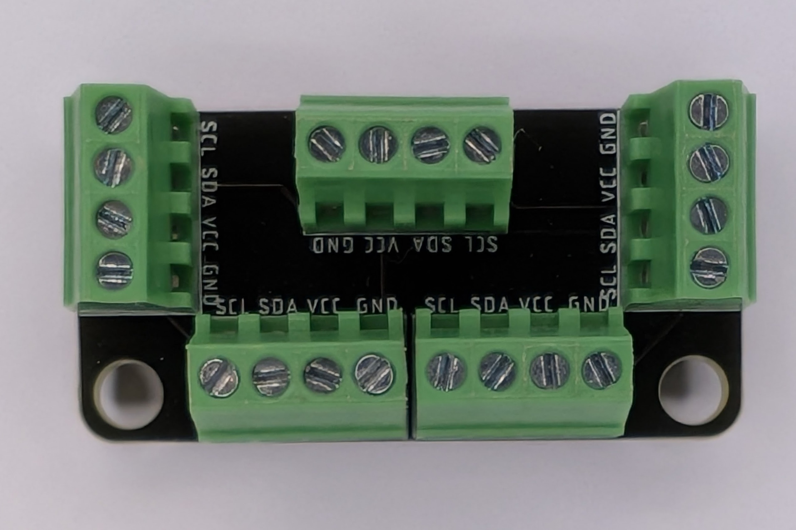
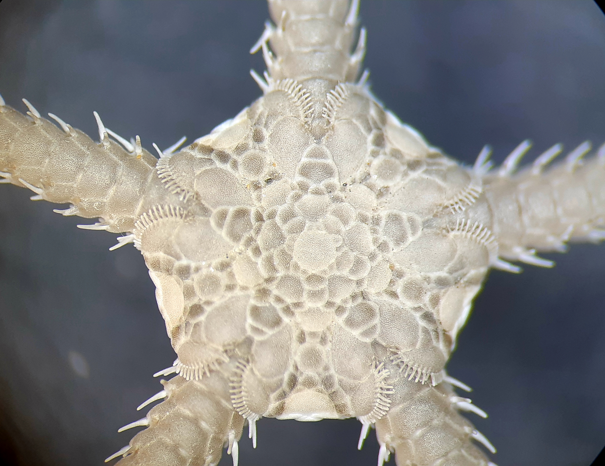

# Project Ophiura

*I2C and RS-485 bus breakout boards by [Northern Widget LLC](https://www.northernwidget.com)*

## Namesake

***Ophiura albida*, a brittle star.** *Photo by Andrea Bonifazi, [CC BY-SA 4.0](https://creativecommons.org/licenses/by-sa/4.0/).*

*Ophiura* (pronounced "oh-FYOO-rah"; from Greek *ophioura*, "snake-tailed") is a genus of brittle stars — marine invertebrates related to sea stars but built for sensing and coordinated movement. When a brittle star locomotes, one arm leads as a sensory probe while the other four row in coordinated response. Crucially, all four trailing arms continuously send proprioceptive feedback back to the central disc, which integrates and adjusts. The result is a true bidirectional hub: signals flow outward from one to four, and inward from four back to one.

This maps directly onto I2C: one upstream connection carries clock and commands outward to sensors, while sensors pull the data line back to return their readings. Project Ophiura is not a splitter — it is a hub.

## Overview

Project Ophiura is a family of compact breakout boards for distributing bus connections. The most widely used board is the **BusBreakout\_I2C**, which connects a single upstream I2C connection (SCL, SDA, VCC, GND) to four independent downstream screw-terminal ports — making it easy to wire multiple sensors to one data logger or microcontroller without soldering.

Because the board is simply a passive connection hub, it can also serve as a general-purpose wire distribution point for any four-wire signal.

## [BusBreakout\_I2C](BusBreakout_I2C/)

One upstream I2C connection (typically a 4-pin header from a data logger such as the [Northern Widget Margay](https://github.com/NorthernWidget/Project-Margay)) fans out to four downstream screw-terminal ports. Each port carries SCL, SDA, VCC, and GND. No active components — plug in, tighten screws, done.

### Pinout

| Pin | Signal | Description |
|-----|--------|-------------|
| 1 | SCL | I2C clock |
| 2 | SDA | I2C data |
| 3 | 3V3 | 3.3 V power |
| 4 | GND | Ground |

Connectors are 4-position, 2.54 mm pitch screw terminals (OnShore OSTVN04A150, Digikey [ED10563-ND](https://www.digikey.com/en/products/detail/on-shore-technology-inc/OSTVN04A150/1588866)).

### [BusBreakout\_I2C\_Mini](BusBreakout_I2C_Mini/)

Electrically identical to the BusBreakout\_I2C but in a smaller footprint for space-constrained installations. Mounting holes are unpopulated (DNP) on this variant.

## [Switched\_I2C](Switched_I2C/)

Active I2C breakout with per-port hardware isolation and switchable power. Unlike the passive BusBreakout\_I2C, this board connects only one downstream port's SDA line to the master at a time — allowing **multiple sensors with the same I2C address** to share a single bus without address conflicts.

### Key components

| Component | Function |
|-----------|----------|
| TCA9534A (I2C GPIO expander) | Controls mux select lines and power switches over I2C |
| SN74LV4051A (8-channel analog mux) | Hardware-isolates SDA per port |
| N-channel MOSFETs | Switch VCC to each downstream port independently |

### How it works

The **TCA9534A** (I2C address 0x20–0x27, configurable via A0/A1/A2 pins) drives GPIO outputs that:

1. Set the SN74LV4051A select lines to route one port's SDA to the master
2. Drive MOSFETs to power individual ports on or off

SCL is shared across all ports. Only the selected port's SDA is connected to the bus — the others are hardware-isolated. This means four identical sensors (same chip, same I2C address) can be connected to four ports and addressed one at a time by switching the mux. A `/INT` interrupt output from the TCA9534A can signal the host when a port state changes.

## [RS485\_Breakout](RS485_Breakout/)

Passive RS-485 bus breakout providing screw-terminal access to a full-duplex RS-485 differential pair plus power. No transceiver on board — the RS-485 driver/receiver is expected on the data logger or microcontroller side.

### Pinout

| Pin | Signal | Description |
|-----|--------|-------------|
| 1 | VCC | Power |
| 2 | GND | Ground |
| 3 | TX+ | Transmit positive (from master) |
| 4 | TX− | Transmit negative (from master) |
| 5 | RX+ | Receive positive (to master) |
| 6 | RX− | Receive negative (to master) |

Connectors are 6-position, 2.54 mm pitch screw terminals (OnShore OSTVN06A150, Digikey [ED10565-ND](https://www.digikey.com/en/products/detail/on-shore-technology-inc/OSTVN06A150/1588868)).

### Termination

SMT normally-open jumpers are provided for line termination. Close the jumper if this board is at the physical end of the RS-485 bus (standard termination: 120 Ω across the differential pair). Four mounting holes are provided in two sizes: 2×56 and 4×40.

## License

 This work is licensed under a <a rel="license" href="http://creativecommons.org/licenses/by-sa/4.0/">Creative Commons Attribution-ShareAlike 4.0 International License</a>.
