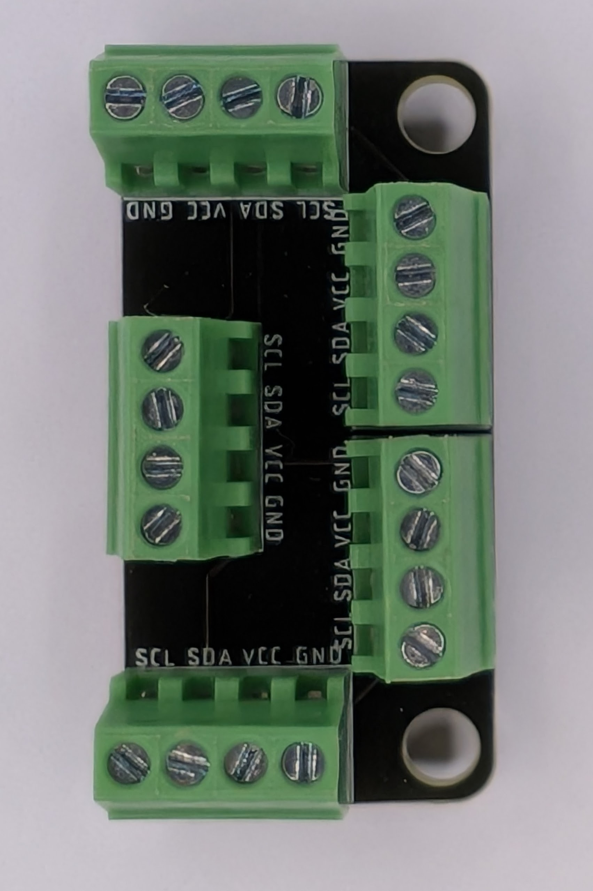
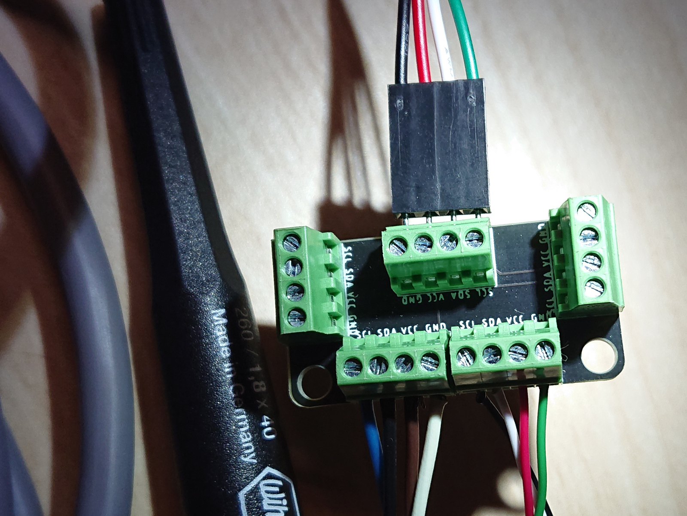

# Project Heptapod

*I2C and RS-485 bus breakout boards by [Northern Widget LLC](https://www.northernwidget.com)*

## Overview

Project Heptapod is a family of compact breakout boards for distributing bus connections. The most widely used board is the **BusBreakout\_I2C**, which splits a single I2C connection (SCL, SDA, VCC, GND) into four independent downstream ports via screw terminals — making it easy to wire multiple sensors to one data logger or microcontroller without soldering.

Because the board is simply a passive connection hub, it can also serve as a general-purpose wire distribution point for any four-wire signal.

## BusBreakout\_I2C

One upstream I2C connection (typically a 4-pin header from a data logger such as the [Northern Widget Margay](https://github.com/NorthernWidget/Project-Margay)) fans out to four downstream screw-terminal ports. Each port carries SCL, SDA, VCC, and GND. No active components — plug in, tighten screws, done.

A **Mini** variant (`BusBreakout_I2C_Mini`) is also available with a smaller footprint for space-constrained installations.

## Other Boards

**Switched\_I2C** — I2C breakout with software-switchable power per port, allowing the host to selectively energize sensors and minimize quiescent current in low-power deployments.

**RS485\_Breakout** — RS-485 bus breakout for multi-drop sensor networks over long cable runs.

## License

 This work is licensed under a <a rel="license" href="http://creativecommons.org/licenses/by-sa/4.0/">Creative Commons Attribution-ShareAlike 4.0 International License</a>.
